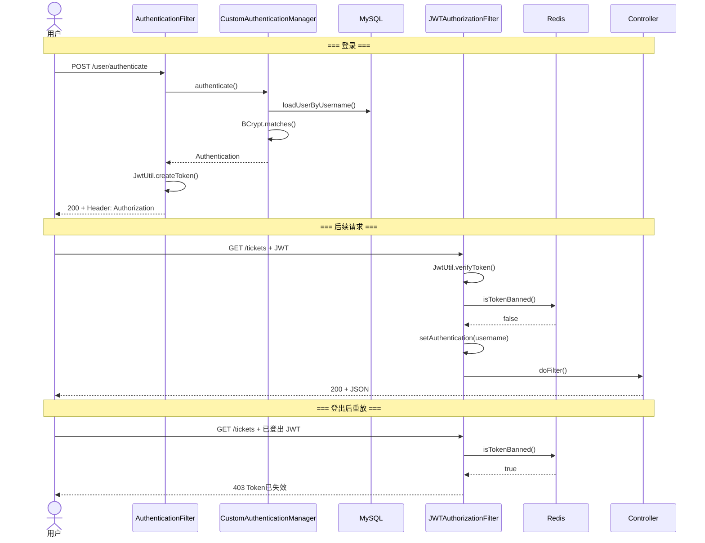
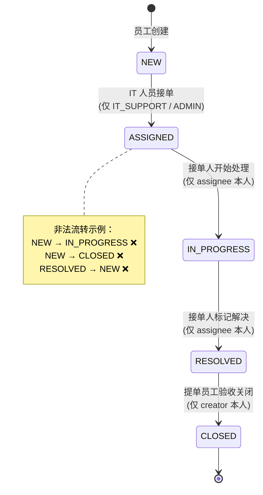

# IT Service Ticket System

基于开源项目二次开发的后端工单管理系统。提供用户认证、三级权限隔离、
工单五态流转、评论审计、Redis 缓存等能力，Docker 一键启动。

## 技术栈

| 组件 | 实现 |
|---|---|
| 框架 | Spring Boot 3.4 + Spring Security 6 |
| 认证 | JWT (auth0 java-jwt) + Redis 黑名单登出 |
| 持久层 | Spring Data JPA (Hibernate 6) + JpaSpecificationExecutor |
| 缓存 | Redis 7 + Spring Cache + CacheErrorHandler 降级 |
| 数据库 | MySQL 8.0 |
| 构建 | Maven 3.9 + JDK 17 |
| 部署 | Docker 多阶段构建 + docker-compose 健康检查编排 |

## 项目结构

```
src/main/java/com/codelogium/ticketing/
├── common/            Result<T> 统一响应体
├── config/            OpenAPI 文档配置、Redis 缓存配置
├── dto/request/       入参 DTO（含 @Valid 校验）
├── dto/response/      出参 DTO（字段脱敏，不暴露 Entity）
├── entity/             JPA 实体 + 枚举（Status / UserRole 等）
├── exception/          自定义异常 + GlobalExceptionHandler
├── mapper/             手写 Mapper + MapStruct 编译期生成
├── repository/         JpaRepository + Specification 动态查询
├── security/           Filter 链、JWT 签发/校验、Token 黑名单
├── service/            业务逻辑层
├── util/               工具类
└── web/                Controller 层
```

## 系统架构

```mermaid
graph TB
    subgraph Client["客户端"]
        Browser["浏览器 / Apifox"]
    end

    subgraph Filters["Spring Security 过滤器链"]
        direction LR
        EF["ExceptionHandlerFilter<br/>捕获过滤器层异常"]
        AF["AuthenticationFilter<br/>处理登录，签发 JWT"]
        JF["JWTAuthorizationFilter<br/>校验 JWT + Redis 黑名单"]
    end

    subgraph Controllers["Controller 层"]
        UC["UserController"]
        TC["TicketController"]
        CC["CommentController"]
        AC["AuthController"]
    end

    subgraph Services["Service 层"]
        TS["TicketServiceImp<br/>FSM 校验 / RBAC 数据隔离"]
        US["UserServiceImp"]
        CS["CommentServiceImp"]
    end

    subgraph Infra["基础设施"]
        MySQL[("MySQL 8.0")]
        Redis[("Redis 7<br/>缓存 + 黑名单")]
    end

    Browser --> EF --> AF --> JF
    JF --> UC & TC & CC & AC
    UC & TC & CC & AC --> US & TS & CS
    US & TS & CS --> MySQL
    TS -.->|@Cacheable / @CacheEvict| Redis
    JF -.->|黑名单检查| Redis
```

## JWT 认证全流程



## 工单五态流转



## 快速启动

```bash
# 1. 克隆代码
git clone <your-repo-url>
cd it-support-ticket-system-main

# 2. 启动（需 Docker Desktop 运行中）
docker compose up -d --build

# 3. 等待约 30 秒（MySQL 健康检查通过后 App 自动启动）
# 浏览器打开：http://localhost:8080/swagger-ui/index.html
```

### 内置测试账号

| 角色 | 用户名 | 密码 | 权限 |
|---|---|---|---|
| 员工 | zhangsan | 123456 | 创建工单、关闭自己的工单 |
| IT 支持 | it_wang | 123456 | 接单、处理、解决工单 |
| IT 支持 | it_li | 123456 | 同上（用于权限隔离验证） |
| 管理员 | admin | admin123 | 用户管理、查看全局工单 |

> 注：首次启动时数据库为空，需通过 `POST /users` 注册用户后使用。以上账号为本地已初始化数据。

### 停止

```bash
docker compose down        # 保留数据
docker compose down -v     # 清除所有数据
```

## 本地开发

```bash
# 本地安装 JDK 17+、Maven、MySQL 8.0、Redis 7
mysql -uroot -proot123 -e "CREATE DATABASE IF NOT EXISTS it_service_ticket_system DEFAULT CHARSET utf8mb4;"
./mvnw spring-boot:run -Dspring-boot.run.profiles=dev
```

## License

MIT
